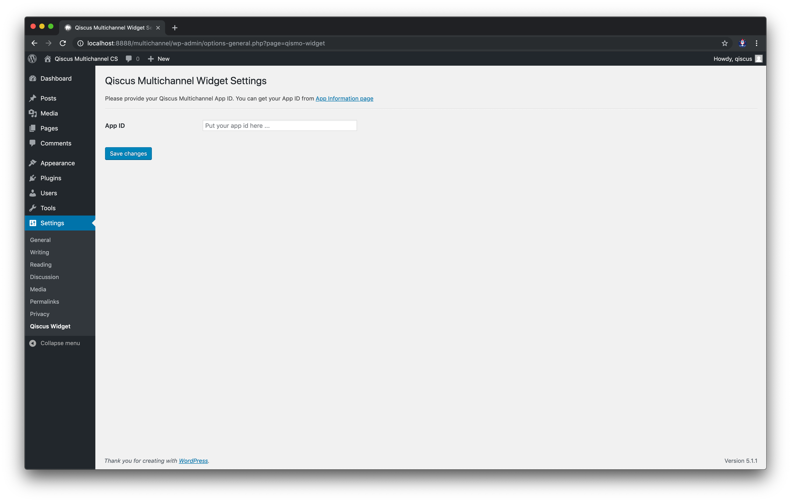
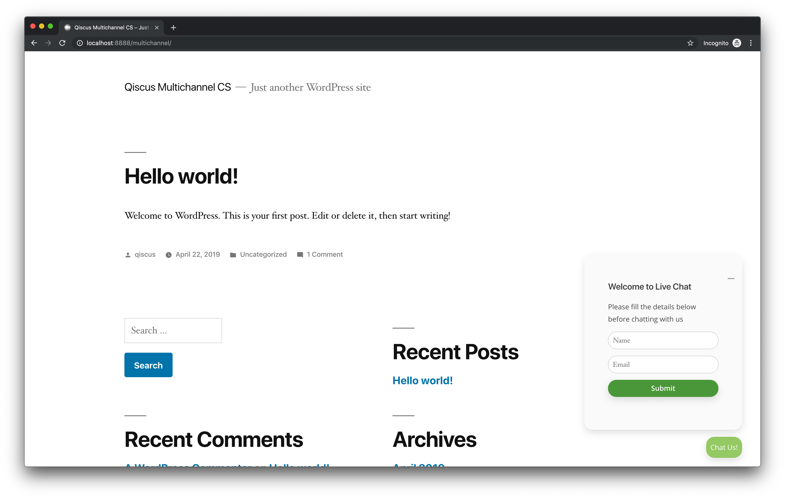
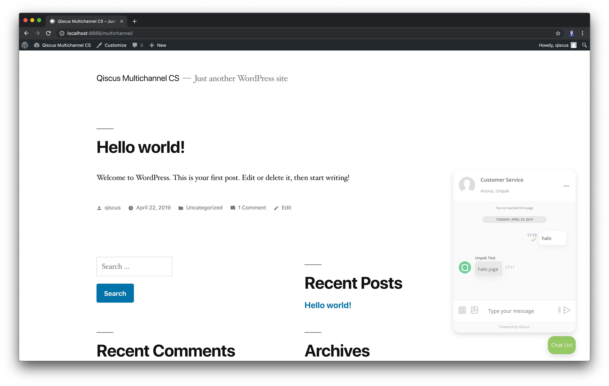

=== Qismo Widget ===

Contributors: (nurulishlah)
Donate link: https://ishlah.github.io
Tags: widget, qismo, qiscus multichannel
Requires at least: 3.0.1
Tested up to: 5.1.1
Stable tag: 5.1.1
License: GPLv2 or later
License URI: http://www.gnu.org/licenses/gpl-2.0.html

A simple plugin to integrate Qiscus Multichannel Customer Service (Qismo) Widget into WordPress Site.

== Description ==

Qiscus Multichannel Customer Service Chat widget provides an easy way to engage with customer via chat widget in your website.
This plugin help you to easily render the widget in your WordPress site.

== Installation ==

1. Upload `qismo-widget` directory to the `/wp-content/plugins/` directory
1. Activate the plugin through the 'Plugins' menu in WordPress
1. Go to the Settings page and provide your Qiscus Multichannel App ID

== Frequently Asked Questions ==

= How to change the widget user interface?

You can do that through Qiscus multichannel dashboard in [the Integration page](https://qismo.qiscus.com/integration) 

== Screenshots ==

1. 
2. 
2. 

== Changelog ==

= 0.1.0 =
* Initial release.
* Provide a form to input Qiscus Multichannel App ID